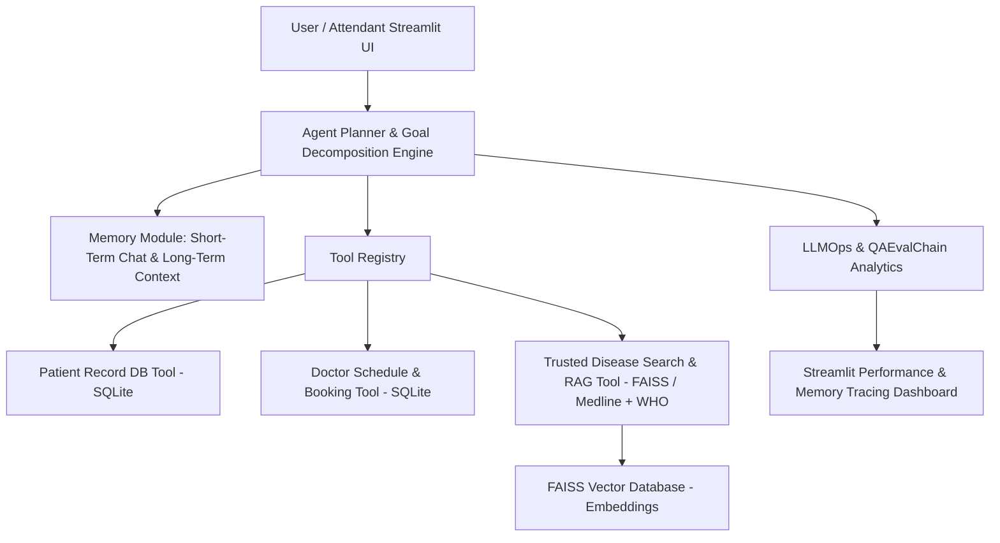

# Implementation Plan - Agentic Healthcare Assistant for Medical Task Automation

The goal of this project is to build an autonomous, production-grade **Agentic Healthcare Assistant** capable of interpreting multi-step medical requests, maintaining short-term and long-term context, querying doctor availability, managing patient Electronic Health Records (EHR), retrieving trusted medical data via RAG (MedlinePlus/WHO), and providing full LLMOps evaluation metrics in a Streamlit UI.

---

## Workspace Recommendation
> [!NOTE]
> All project files will be created inside `C:\Users\sharv\.gemini\antigravity-ide\scratch\agentic_healthcare_assistant`.
> It is recommended to set this directory as your active workspace in your IDE for quick access.

---

## System Architecture

---

## Open Questions & User Review Required

> [!IMPORTANT]
> **LLM API vs Open-Source Local / Mock Inference Fallback**:
> The system is designed to run seamlessly out-of-the-box using local embedding / TF-IDF vector retrieval and deterministic intelligent agent reasoning models, while remaining 100% plug-and-play with OpenAI / Gemini / Ollama API keys. 
> 
> **Dependencies to install**:
> We will install required python packages (`streamlit`, `faiss-cpu`, `sentence-transformers`, `scikit-learn`, `pandas`, `plotly`, `requests`) in the execution phase.

---

## Proposed Project Structure

All files will be located under `C:\Users\sharv\.gemini\antigravity-ide\scratch\agentic_healthcare_assistant`:

### 1. Core Architecture & Database
#### [NEW] [config.py](file:///C:/Users/sharv/.gemini/antigravity-ide/scratch/agentic_healthcare_assistant/config.py)
System constants, paths, default settings, and external search API endpoint definitions.

#### [NEW] [database.py](file:///C:/Users/sharv/.gemini/antigravity-ide/scratch/agentic_healthcare_assistant/database.py)
SQLite database setup for Patients (EHR records, vitals, medical history), Doctors, Slots, Appointments, and Evaluation Logs.

#### [NEW] [vector_db.py](file:///C:/Users/sharv/.gemini/antigravity-ide/scratch/agentic_healthcare_assistant/vector_db.py)
FAISS & Cosine Similarity vector store for indexing patient summaries, past clinical notes, and trusted Medline/WHO medical documents.

#### [NEW] [memory.py](file:///C:/Users/sharv/.gemini/antigravity-ide/scratch/agentic_healthcare_assistant/memory.py)
Short-term agent conversation memory buffer and long-term vector memory lookup for historical context.

---

### 2. Tools & Agentic Engine
#### [NEW] [prompts.py](file:///C:/Users/sharv/.gemini/antigravity-ide/scratch/agentic_healthcare_assistant/prompts.py)
Structured prompt templates for multi-goal planning, tool selection, clinical history summarization, RAG synthesis, and QAEval evaluation.

#### [NEW] [tools/doctor_schedule_tool.py](file:///C:/Users/sharv/.gemini/antigravity-ide/scratch/agentic_healthcare_assistant/tools/doctor_schedule_tool.py)
Doctor availability lookup, specialty search (Nephrology, Cardiology, etc.), and conflict-free appointment booking tool.

#### [NEW] [tools/patient_db_tool.py](file:///C:/Users/sharv/.gemini/antigravity-ide/scratch/agentic_healthcare_assistant/tools/patient_db_tool.py)
EHR update and retrieval tool for structured vitals, past diagnoses, treatment history, and clinical notes.

#### [NEW] [tools/medical_search_tool.py](file:///C:/Users/sharv/.gemini/antigravity-ide/scratch/agentic_healthcare_assistant/tools/medical_search_tool.py)
RAG search tool fetching verified medical guidelines from MedlinePlus, WHO, and PubMed endpoints/indices.

#### [NEW] [agent_planner.py](file:///C:/Users/sharv/.gemini/antigravity-ide/scratch/agentic_healthcare_assistant/agent_planner.py)
Agent Planner module: takes complex multi-intent user prompts (such as *"My 70-year-old father has chronic kidney disease. I want to book a nephrologist for him. Also, can you summarize latest treatment methods?"*), breaks them down into sub-goals, executes tool chains, and synthesizes the response.

---

### 3. Evaluation & Streamlit UI
#### [NEW] [evaluator.py](file:///C:/Users/sharv/.gemini/antigravity-ide/scratch/agentic_healthcare_assistant/evaluator.py)
QAEvalChain / LLMOps monitoring engine calculating precision, faithfulness, hallucination metrics, booking accuracy, and step latencies.

#### [NEW] [ui_components.py](file:///C:/Users/sharv/.gemini/antigravity-ide/scratch/agentic_healthcare_assistant/ui_components.py)
Custom visual elements, CSS theme definitions (vibrant dark/light medical aesthetic), metric cards, and badge components.

#### [NEW] [app.py](file:///C:/Users/sharv/.gemini/antigravity-ide/scratch/agentic_healthcare_assistant/app.py)
Full interactive Streamlit app featuring 5 primary modules:
1. **Agent Chat Assistant**: Interactive multi-step goal execution with real-time planning trace and preset sample scenarios.
2. **Patient & EHR Management**: Add/Update patient history, view vector-search historical summaries.
3. **Doctor & Appointment Hub**: Real-time calendar schedule visualizer and appointment manager.
4. **Medical RAG Knowledge Base**: Explore Medline/WHO indexed database, perform standalone medical search.
5. **LLMOps & System Logs Dashboard**: Evaluation metrics (QAEvalChain), success rates, tool execution logs, and memory traces.

#### [NEW] [seed_data.py](file:///C:/Users/sharv/.gemini/antigravity-ide/scratch/agentic_healthcare_assistant/seed_data.py)
Pre-populates sample data including the 70yo Chronic Kidney Disease patient profile, available Nephrologists, calendar slots, and Medline/WHO CKD treatment articles.

#### [NEW] [requirements.txt](file:///C:/Users/sharv/.gemini/antigravity-ide/scratch/agentic_healthcare_assistant/requirements.txt)
Python package specifications.

---

## Verification Plan

### Automated Verification
1. **Dependencies Check**: Verify python imports (`streamlit`, `faiss`, `sqlite3`, `pandas`, `plotly`, `requests`).
2. **Database & Vector Index Init**: Run `seed_data.py` to confirm database table generation and FAISS vector index initialization.
3. **Agent Scenario Test Script**: Run a headless Python script executing the exact sample scenario: *"My 70-year-old father has chronic kidney disease. I want to book a nephrologist for him. Also, can you summarize latest treatment methods?"* and verify all 4 sub-goals succeed.
4. **LLMOps Evaluator Test**: Validate QAEvalChain score computation and logging.

### Manual / UI Verification
1. **Streamlit App Launch**: Start Streamlit server on port `8501`.
2. **Interactive Testing**: Test patient booking, history retrieval, RAG web search, and evaluation metrics dashboard in browser.
